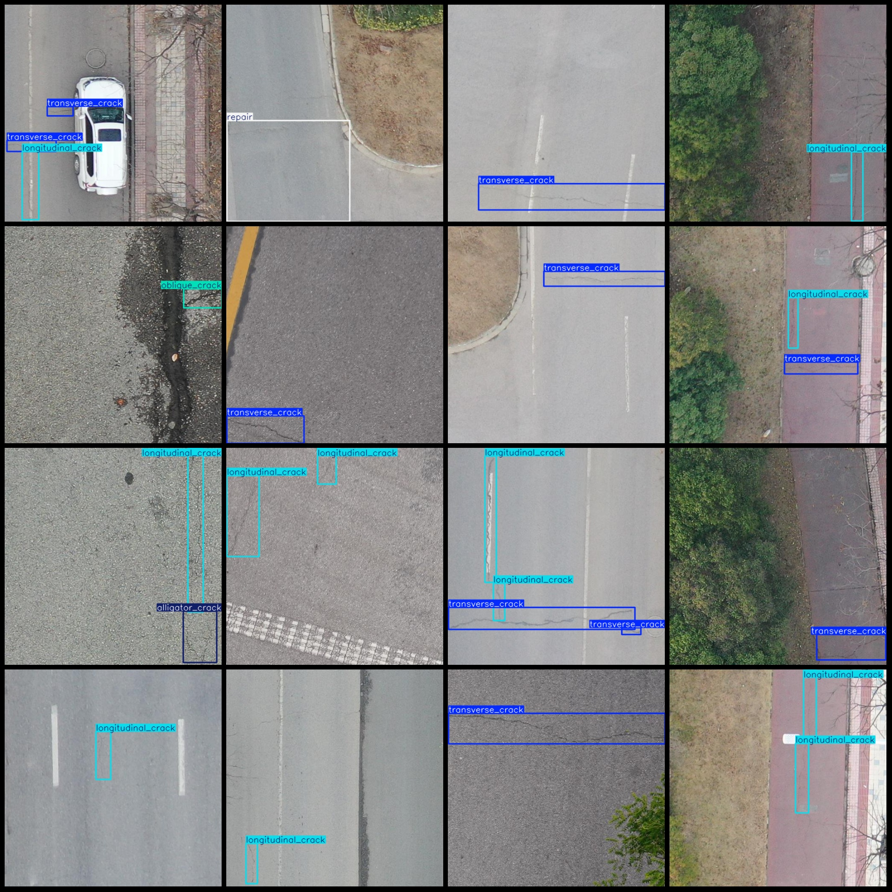
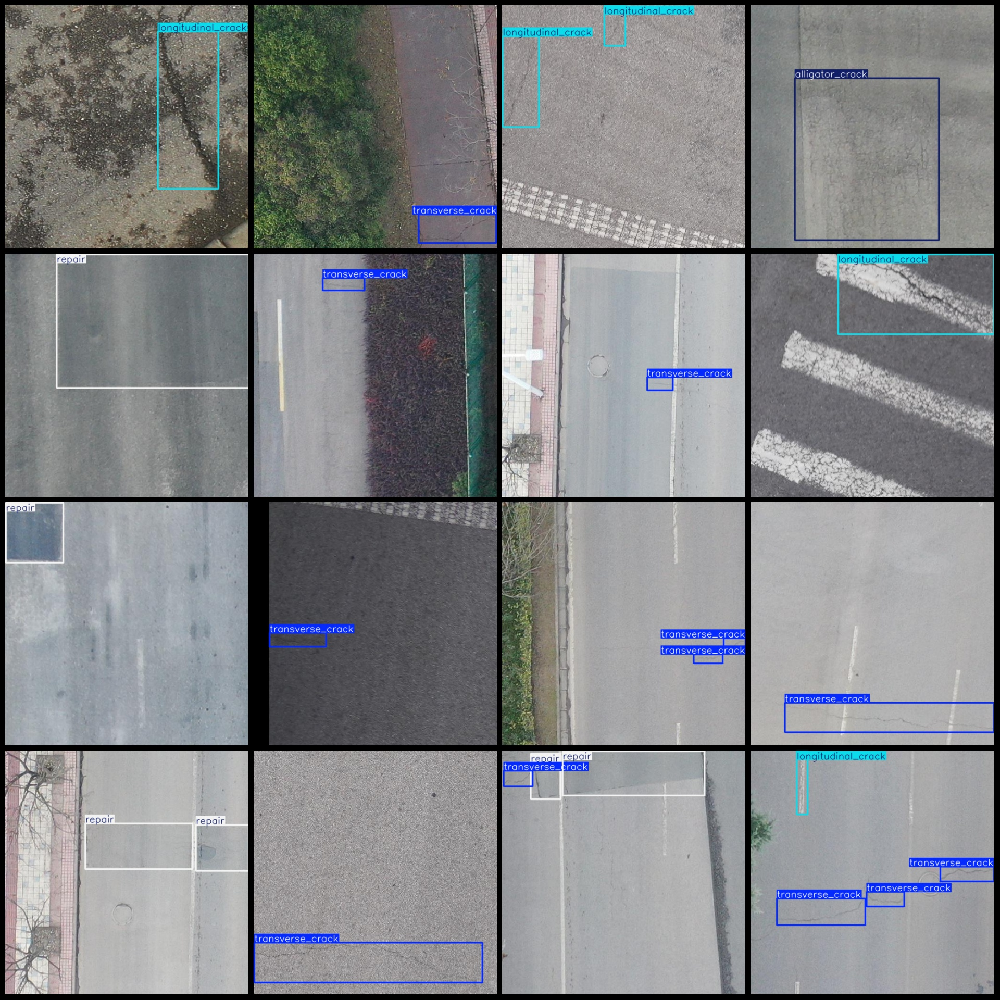

# UAV Viewpoint Aerial Photos of Road Crack and Hole Detection Dataset VOC+YOLO Format 999 Images in 7 Categories

Dataset format: Pascal VOC format + YOLO format (txt file without split path, only containing jpg images and corresponding VOC format xml files and yolo format txt files)
number of images: 999  
Number of xml files: 999
Number of txt files: 999
Number of categories: 7
["alligator_crack", "block_crack", "longitudinal_crack", "oblique_crack", "pothole", "repair", "transverse_crack"]
boxes per class:   
Alligator Crack (Crinkle) Box Count = 81
Block crack = 3
Longitudinal crack (Longitudinal crack) Frames = 602
The oblique_crack function in the OpenCV library is used to detect and classify skew cracks. The box count parameter indicates the number of boxes that should be returned by the function. In this case, the box count is set to 56.
Pothole (Pit) Number = 8
Repair box count = 219
Transverse crack box count = 637
total boxes: 1606  
images per class:   
The function alligator_crack images = 72 is a Python function that takes an image as input and returns the number of alligator cracks in the image. The function uses the OpenCV library to detect the alligator cracks in the image.

Here's an example implementation of the function:

```python
import cv2

def alligator_crack(image):
    # Load the image
    image = cv2.imread(image)

    # Convert the image to grayscale
    gray = cv2.cvtColor(image, cv2.COLOR_BGR2GRAY)

    # Apply thresholding to convert the image to binary
    _, binary = cv2.threshold(gray, 127, 255, cv2.THRESH_BINARY)

    # Find contours in the binary image
    contours, _ = cv2.findContours(binary, cv2.RETR_EXTERNAL, cv2.CHAIN_APPROX_SIMPLE)

    # Iterate over the contours and count the alligator cracks
    num_alligator_crack = 0
    for contour in contours:
        # Calculate the area of the contour
        area = cv2.contourArea(contour)

        # If the area is greater than a certain threshold, it's an alligator crack
        if area > 1000:
            num_alligator_crack += 1

    return num_alligator_crack

# Example usage:
images = ['image1.jpg', 'image2.jpg', 'image3.jpg']
for image in images:
    num_alligator_crack = alligator_crack(image)
    print(f"Number of alligator cracks in {image}: {num_alligator_crack}")
```

This code will output the number of alligator cracks in each image in the list `images`. Note that you need to replace `'image1.jpg'`, `'image2.jpg'`, `'image3.jpg'` with the actual paths to your images.
```python
def block_crack(images):
    images = np.array(images)
    # ...
```
Longitudinal crack images = 463
The image is a 46-point oblique crack.
Pothole images = 8  
Repair images = 162  
Transverse crack images = 506
image resolution: 512x512  
Using annotation tool: labelImg
Annotation rules: Draw a box around the class for each image
Important notes: The dataset does not have separate training, validation, and test sets. You need to manually divide them.
Special statement: This dataset does not guarantee any accuracy in the trained models or weight files.
Image preview:
Annotation example:
## Images





Here is a pay link on Stripe ( https://buy.stripe.com/3cs8yP7sY87d0vu9AB ). Please contact me lonlonago@foxmail.com after funding $89, and I will send you a complete data files , thank you!

